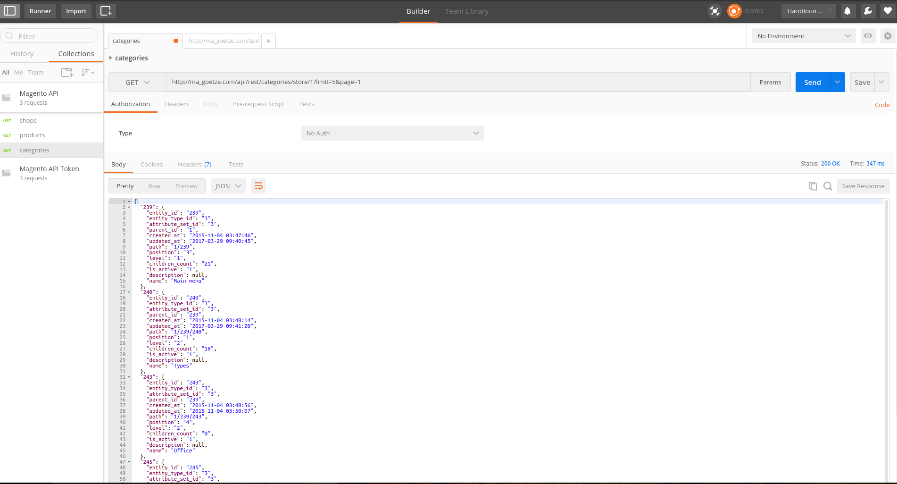

# ITology_RestApi
Magento Rest API

-------------------------------------------------------------------------------------------

http://[your_domain]/api/rest/categories/[category_id]/store/[store_id]

Get current category details and his child details 

-------------------------------------------------------------------------------------------

Get all categories with using limit and page attributes

http://[your_domain]/api/rest/categories/store/[store_id]?limit=5&page=1

-------------------------------------------------------------------------------------------

To use this extension please just copy and paste the app folder in your project
